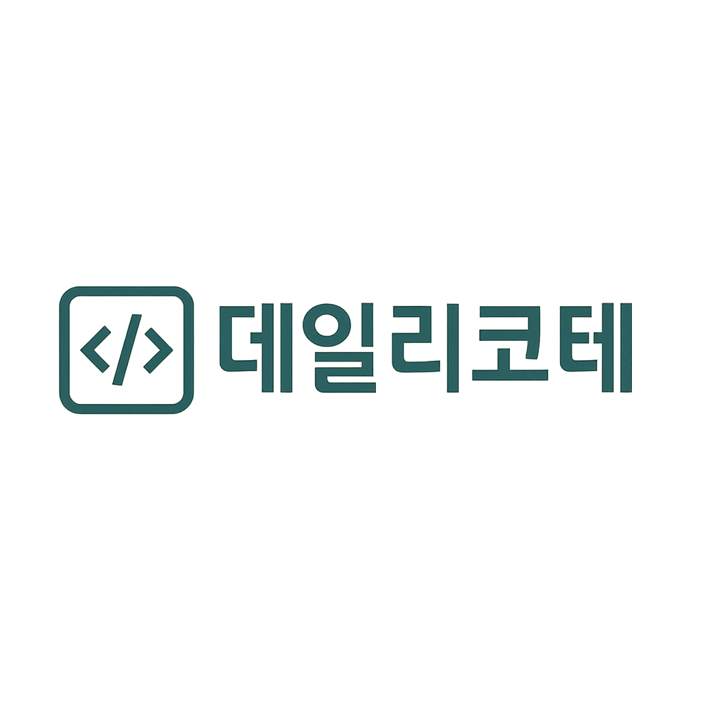

<div id="top"></div>

<div align='center'>

<h1><b>데일리 코테</b></h1>
<h3><b>프로그래머스 4기 5회차 3차 프로젝트</b></h3>

🔗 [데일리 코테 바로가기](https://peaceful-manatee-287118.netlify.app/)



</div>

<br>

## 0. 목차

1. [프로젝트 소개](#1)
2. [팀원 소개](#2)
3. [개발 일정](#3)
4. [기술 스택](#4)
5. [라이브러리 사용 이유](#5)
6. [컨벤션](#6)
7. [브랜치 및 디렉토리 구조](#7)
8. [주요 기능 소개](#8)
9. [상세 담당 업무](#9)
10. [시작 가이드](#10)

<br />

## <span id="1">🚩 1. 프로젝트 소개</span>

**Notion**: [프로젝트 노션 링크](https://smiling-wednesday-6f2.notion.site/3-217871ecd4fe8095b78cf73b4a80da58?source=copy_link)

**PPT**: [프로젝트 발표 자료](https://www.figma.com/slides/Y3Flaz57z86rCUocOMPWCU/FE5-3%EC%B0%A8-1%ED%8C%80-%EC%9D%B4%EC%A1%B0%EC%B5%9C%EA%B3%A0-%EB%B0%9C%ED%91%9C%EC%9E%90%EB%A3%8C?node-id=1-650&t=X6QuE1lqBrhG2Mlm-1)

React + TypeScript + Supabase를 활용한 데일리 학습 커뮤니티 제작.

<br>

<!-- Top Button -->
<p style='background: black; width: 32px; height: 32px; border-radius: 50%; display: flex; justify-content: center; align-items: center; margin-left: auto;'><a href="#top" style='color: white; '>▲</a></p>

<br>

## <span id="2">🏃 2. 팀원 소개</span>

|  |  |  |  |  |
| :--------------------------------------------------------------: | :--------------------------------------------------------------: | :-----------------------------------------------------------: | :--------------------------------------------------------------: | :--------------------------------------------------------------: |
|                           |                           |                        |                           |                           |
|               [이재건](https://github.com/79gun79)               |              [이준수](https://github.com/dlakrp123)              |           [조소정](https://github.com/chosojeong97)           |               [조정우](https://github.com/mafornp)               |             [최연서](https://github.com/CHOIYEONSEO)             |
|                               팀장                               |                                퍼블리싱, 기능개발                                |                              디자인, 퍼블리싱, 기능개발                               |                               퍼블리싱, 기능개발                                |                                DB구축, 퍼블리싱, 기능개발                                |
|                                ㅇ                                |                                ㅇ                                |                              ㅇ                               |                                ㅇ                                |                                ㅇ                                |

<br>

<!-- Top Button -->
<p style='background: black; width: 32px; height: 32px; border-radius: 50%; display: flex; justify-content: center; align-items: center; margin-left: auto;'><a href="#top" style='color: white; '>▲</a></p>

<br>

## <span id="3">📅 3. 개발 일정</span>

> 프로젝트 개발 기간: 2025.05.21 - 2025.06.19 (28일)

<br>

<!-- Top Button -->
<p style='background: black; width: 32px; height: 32px; border-radius: 50%; display: flex; justify-content: center; align-items: center; margin-left: auto;'><a href="#top" style='color: white; '>▲</a></p>

<br>

## <span id="4">📚 4. 기술 스택</span>

### Environment


### Config


### Development


### Project Management

[Github Pull requests](https://github.com/79gun79/LeeJoChoigo/pulls?q=is%3Apr+is%3Aclosed)

### Design

[Figma](https://www.figma.com/design/BChHsGy3sw1R2UPmUGI7AR/FE5-3%EC%B0%A8-1%ED%8C%80-%EC%9D%B4%EC%A1%B0%EC%B5%9C%EA%B3%A0-%ED%94%84%EB%A1%9C%EC%A0%9D%ED%8A%B8?node-id=0-1&t=qqpR5IgzM7nq9jke-1)

### Hosting


### Communication


<br>

<!-- Top Button -->
<p style='background: black; width: 32px; height: 32px; border-radius: 50%; display: flex; justify-content: center; align-items: center; margin-left: auto;'><a href="#top" style='color: white; '>▲</a></p>

<br>

## <span id="5">❓ 5. 라이브러리 사용 이유</span>

> React + TypeScript: 프로젝트 환경

<br>

> Zustand: 전역 상태 설정

<br>

> Supabase: 원하는 데이터 저장

<br>

> Tailwind CSS: 스타일

<br>

<!-- Top Button -->
<p style='background: black; width: 32px; height: 32px; border-radius: 50%; display: flex; justify-content: center; align-items: center; margin-left: auto;'><a href="#top" style='color: white; '>▲</a></p>

<br>

## <span id="6">🤝 6. 컨벤션</span>

### prettier

```json
{
  "semi": true,
  "singleQuote": true,
  "tabWidth": 2,
  "useTabs": false,
  "plugins": ["prettier-plugin-tailwindcss"]
}
```

### 커밋 컨벤션

| **타입** | **설명**                                     |
| -------- | -------------------------------------------- |
| feat     | 새로운 기능 추가                             |
| refactor | 코드 리팩토링                                |
| fix      | 버그 수정                                    |
| chore    | 패키지 매니저, 설정 세팅                     |
| init     | 초기 세팅 및 종속성 추가 관련                |
| docs     | 문서 수정                                    |
| pencil   | 오탈자 또는 문구, 변수명 수정                |
| zap      | 기능 개선 및 변경                            |
| poop     | 코드 또는 파일 삭제                          |
| design   | 문서 수정                                    |
| style    | 코드 포맷팅, 세미콜론 누락 등 코드 변경 없음 |
| test     | 테스트 코드, 리팩토링 테스트 코드 추가       |

#### 커밋 예시

- feat: 페인페이지 레이아웃 구현
- fix: 잘못된 날짜 형식 문제 해결

<br>

<!-- Top Button -->
<p style='background: black; width: 32px; height: 32px; border-radius: 50%; display: flex; justify-content: center; align-items: center; margin-left: auto;'><a href="#top" style='color: white; '>▲</a></p>

<br>

## 7.<span id="7"> 🗂️ 브랜치 및 디렉토리 구조</span>

> 브랜치

- `main`: 배포 전용 브랜치, 항상 안정적인 상태 유지
- `dev`: 개발 통합 브랜치, 기능 완성 후 merge
- `feature/기능`: 기능 단위 작업 브랜치, 기능마다 분기해서 작업 진행

<br>

> 디렉토리 구조

```
📂 FiveCoders
├── 📂 src
│   ├── 📂 api             # API 통신 모듈
│   ├── 📂 assets          # 이미지, 폰트 등 정적 리소스
│   │   ├── 📂 fonts
│   │   ├── 📂 images
│   ├── 📂 components      # 컴포넌트 관련 파일 (재사용 가능한 UI)
│   ├── 📂 data            # 프로젝트 적용을 위한 데이터 파일
│   ├── 📂 hooks           # 기능을 재사용하기 위한 훅 파일
│   ├── 📂 layout          # 공통으로 들어가는 레이아웃
│   ├── 📂 loader          # 특정 링크에서 API 응답을 위한 로더
│   ├── 📂 pages           # 라우트 단위 페이지 파일
│   ├── 📂 routes          # 라우트 링크 정보 저장 파일
│   ├── 📂 stores          # 전역 상태 관리 파일
│   ├── 📂 styles          # 전역 스타일 모음
│   ├── 📂 types           # 타입스크립트 타입 정의
│   ├── 📂 utils           # 유틸리티 파일(함수)
│   └── 📄 App.tsx          # 메인 App 컴포넌트
│   └── 📄 main.tsx
│   └── 📄 router.tsx       # 라우터 설정
├── 📂 public
│   └── 📄 favicon.ico     # 사이트 아이콘
└── 📄 package.json        # 프로젝트 종속성 및 설정 파일
└── 📄 tsconfig.json       # 타입스크립트 설정 파일
```

<br>

<!-- Top Button -->
<p style='background: black; width: 32px; height: 32px; border-radius: 50%; display: flex; justify-content: center; align-items: center; margin-left: auto;'><a href="#top" style='color: white; '>▲</a></p>

<br>

## <span id="8">8. 💻 주요 기능 소개</span>

### 1) 홈

| 메인 화면                                         | 다크모드 화면                                     | 내 정보 화면                                      |
| ------------------------------------------------- | ------------------------------------------------- | ------------------------------------------------- |
|  |  |  |

### 2) 게시글

| 알고리즘 풀이                                     | 개발직군 풀이                                     | 게시글 작성                                       |
| ------------------------------------------------- | ------------------------------------------------- | ------------------------------------------------- |
|  |  |  |

### 3) 기타

| 로그인 화면                                       | 태그검색 화면                                     | 404 화면                                          |
| ------------------------------------------------- | ------------------------------------------------- | ------------------------------------------------- |
|  |  |  |

<br>

<!-- Top Button -->
<p style='background: black; width: 32px; height: 32px; border-radius: 50%; display: flex; justify-content: center; align-items: center; margin-left: auto;'><a href="#top" style='color: white; '>▲</a></p>

<br>

## <span id="9">9. 📄 상세 담당 업무</span>

### 1) 이재건

- **✨ 팀장**

  - 프로젝트 초기 세팅 및 관리
  - 노션페이지 작성 및 회의 진행

- **🎨 디자인**

  - 로그인, 회원가입 디자인
  - 퀴즈 생성 디자인
  - 404 페이지 디자인

- **🛠 구현 기능**

  - 개발직군 문제 생성, 풀이
  - 비로그인 모달창
  - 검색 기능

### 2) 이준수

- **💻 화면 개발**

  - 다크모드 UI
  - 회원가입, 로그인 화면
  - 개발직군 문제 상세 화면

- **🛠 구현 기능**

  - 초기 라우팅 구조 설정
  - 알림과 팔로우 기능
  - 헤더 및 사이드바 구축

### 3) 조소정

- **🎨 디자인**

  - 전체적인 UI 디자인 담당
  - 컴포넌트별 디자인 세분화

- **💻 화면 개발**

  - 메인 화면(사용자 활동 요약)
  - 마이 프로필 화면
  - 게시판별 화면 퍼블리싱

- **🛠 구현 기능**

  - 프로필 환경설정 기능
  - 메인페이지 랜덤 추천 기능
  - 메인페이지 인기 추천 기능

### 4) 조정우

- **💻 화면 개발**

  - 레이아웃 구성
  - 질문 게시판 화면
  - 태그 검색 UI

- **🛠 구현 기능**

  - 게시판 에디터 설정
  - 댓글 및 좋아요 기능
  - 태그 기반 검색 및 자동완성 검색 기능

### 5) 최연서

- **💎 데이터베이스 관리**

  - Supabase 데이터베이스 제작 및 관리

- **💻 화면 개발**

  - 커스텀 Alert/Confirm 모달
  - 알고리즘 문제 풀이 생성 화면
  - Top 버튼, 스켈레톤 UI 적용

- **🛠 구현 기능**

  - solved.ac API 데이터 저장
  - Gemini 연결을 통한 문제 요청 기능
  - 알고리즘 문제 풀이를 위한 템플릿 기능

<br>

<!-- Top Button -->
<p style='background: black; width: 32px; height: 32px; border-radius: 50%; display: flex; justify-content: center; align-items: center; margin-left: auto;'><a href="#top" style='color: white; '>▲</a></p>

<br>

## <span id="10">10. 🛠️ 시작 가이드</span>

### Installation

```shell
# 1. 클론하기
$ git clone https://github.com/79gun79/LeeJoChoigo.git .

# 2. 의존성 설치하기
$ npm install

# 3. 개발 서버 실행하기
$ npm run dev
```

<br>

<!-- Top Button -->
<p style='background: black; width: 32px; height: 32px; border-radius: 50%; display: flex; justify-content: center; align-items: center; margin-left: auto;'><a href="#top" style='color: white; '>▲</a></p>
